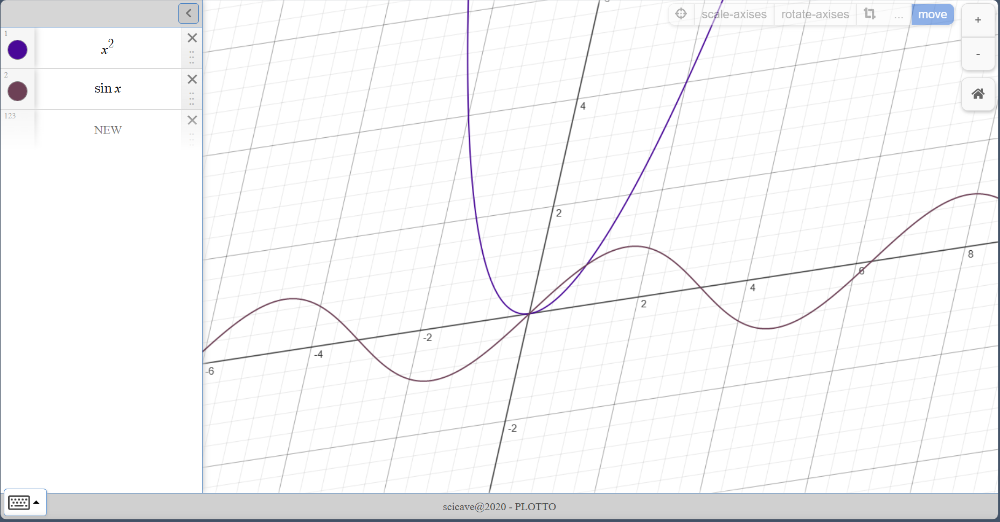

# RASM - Live in Visualized Maths Universe

[](https://app.netlify.com/projects/rasm-graphing/deploys)

A mathematical graphing and visualization application for sketching functions, geometry, and exploring mathematical concepts interactively.



## Architecture

**Monorepo** powered by [Turborepo](https://turbo.build/) and [Bun](https://bun.sh/).

### Packages

| Package                | Description                                  |
| ---------------------- | -------------------------------------------- |
| `@rasm/app`            | Main SolidJS application                     |
| `@rasm/math`           | Math utilities (Vector, Angles, Lines, Core) |
| `@rasm/magical-parser` | Expression parser for mathematical notation  |

### App Structure (`packages/app`)

```
src/
├── components/          # SolidJS UI components
│   ├── App/             # Root app component
│   ├── Layout/          # Canvas, Controls, Keypad containers
│   ├── ChildControl/    # Graph element controls (Slider, Function, etc.)
│   ├── Sketch/          # Canvas rendering
│   └── CoordinatesDisplay/
├── stores/              # Reactive state management
│   ├── controlsStore    # Graph children (functions, variables, sliders)
│   ├── graphSettingsStore # Viewport, pan/zoom, coordinates
│   └── sketchStore      # Drawing queue and canvas state
├── core/                # Core logic
│   ├── GraphChildren/   # Xfunction, Slider, Variable, EvalExpr
│   ├── GraphSetting/    # Transform, CoorManager
│   └── Sketch.js        # Canvas orchestration
└── utils/               # Helpers
```

## Prerequisites

- **Bun** (v1.0+)

## Installation

```bash
bun install
```

## Commands

```bash
bun run dev         # Start dev server with hot reload
bun run build       # Build production bundle
bun run lint        # Lint code
bun run lint:fix    # Fix linting issues
bun run format      # Format code

# Preview production build
bunx turbo --filter @rasm/app preview
```

## TODOs

- [ ] Share the graph as a link
- [ ] Save the graph as an image
- [ ] Record a video for the canvas
- [ ] Build a backend so someone can store his own drawings and visit later
- [ ] History control (undo and redo)
- [ ] Versioning control and save a version
- [ ] Support more math values
  - [ ] Make it support matrices
  - [ ] Make it support complex numbers
- [ ] Draw fractals and The Mandelbrot set
- [ ] More graph children and controls
  - [ ] Implicit functions
  - [ ] Polar functions
    - [ ] $(f(t), g(t))$
    - [ ] $r = f(\theta)$
- [ ]  Long press on a math-field causing a tools bar to appear with a copy as ($\TeX$, ASCII-math), clear.
- [ ]  More advanced objects side panel
    - [ ]  Maybe folders and expressions like Desmos or some thing more flexible like Jupiter Py
    - [ ] Make it sortable and foldable
    - [ ]  Shift CTRL+{{direction}} to move the expression block
- [ ]  Open equation editor `mathquill` in a floating component for larger view to see the full expression
- [ ] OCR for handwritten equations

## License

Apache License 2.0
